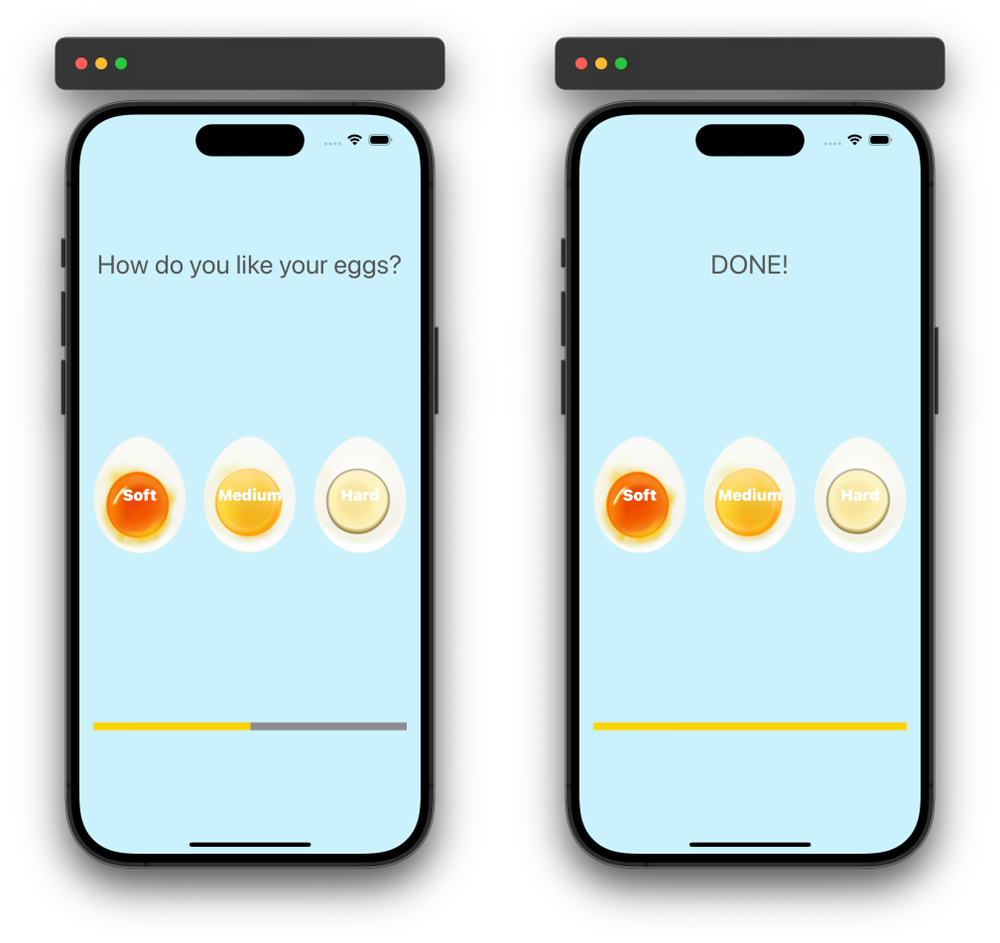

# EggTimer

## Introduction
EggTimer is a simple and intuitive iOS application designed to help you cook eggs to perfection. Whether you prefer your eggs soft, medium, or hard-boiled, EggTimer ensures they are cooked exactly the way you like them. With a user-friendly interface and a reliable timer, you can say goodbye to overcooked or undercooked eggs.

### Preview

  

## Features
- **Easy Selection**: Choose between soft, medium, or hard-boiled eggs with a single tap.
- **Accurate Timing**: Predefined cooking times ensure consistent results.
- **Progress Indicator**: A visual progress bar helps you keep track of the cooking process.
- **Alarm Notification**: An audio alarm notifies you when your eggs are done.
- **Simple Interface**: Clean and minimalistic design for ease of use.

## Code Structure
- **ViewController**: The main view controller managing the timer, UI updates, and handling user interactions.
  - **Properties**:
    - `timer`: A `Timer` object for scheduling the cooking timer.
    - `eggTimes`: A dictionary containing the cooking times for different egg hardness levels.
    - `player`: An `AVAudioPlayer` object for playing the alarm sound.
  - **Outlets**:
    - `titleLabel`: A label displaying the selected hardness level or completion message.
    - `progressBar`: A progress view indicating the cooking progress.
  - **Actions**:
    - `hardnessSelected(_ sender: UIButton)`: Action method triggered when a hardness button is pressed. It starts the timer and updates the UI accordingly.

## Conclusion
EggTimer is designed to take the guesswork out of cooking eggs, providing a reliable and straightforward tool for achieving your desired egg consistency every time. Whether you're a culinary novice or a seasoned chef, EggTimer is the perfect kitchen companion for perfectly cooked eggs. Enjoy the simplicity and precision of EggTimer for all your egg-cooking needs!